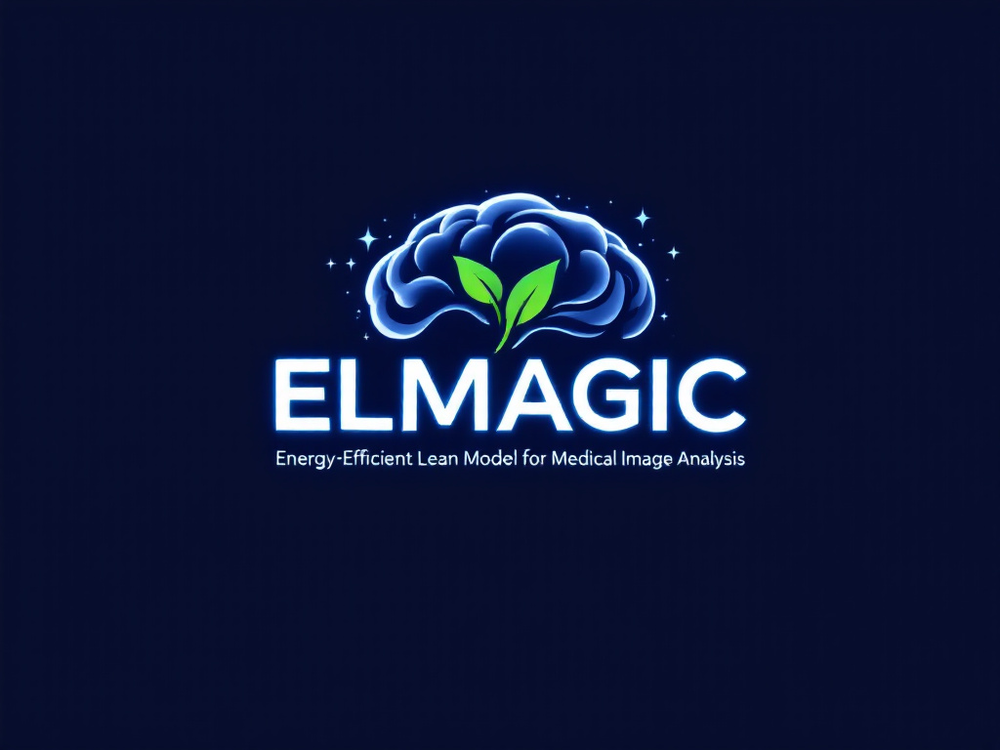

<p align="center">
  <a href="https://github.com/GitsSaikat/ELMAGIC">
    
  </a>
</p>

<h1 align="center">
  <b>ELMAGIC: Energy-Efficient Lean Model for Medical Image Analysis Experiments 🚀</b><br>
 
</h1>

<p align="center">
  📚 <a href="https://github.com/GitsSaikat/ELMAGIC">[GitHub Repository]</a> |
  📝 <a href="https://ieeexplore.ieee.org/document/10585776">[Paper]</a>
</p>

**Hello World, Welcome to the ELMAGIC PyTorch Experiments Repository!**

This repository contains PyTorch code to reproduce the key experiments and results presented in the paper: **ELMAGIC: Energy-Efficient Lean Model for Reliable Medical Image Generation and Classification Using Forward Forward Algorithm**.

Here, you will find implementations of:

*   **Forward-Forward Algorithm (FFA):** Training with positive and negative passes for energy efficiency.
*   **Multi-Teacher Knowledge Distillation (MTKD):** Distilling knowledge from ResNet-18 (Teacher1) and a smaller CNN (Teacher2) into a Lean Student model.
*   **Iterative Magnitude Pruning:** Techniques to reduce model size and improve efficiency while maintaining performance.
*   **Experiments on Medical Image Datasets:** Code for ODIR-5K (Ocular Disease Recognition) and HAM10000 (Skin Lesion Classification) datasets.
*   **Evaluation Metrics:** Calculation of F1 Score, AUC-ROC, and FID score for performance evaluation.
*   **Code to Generate Figures:** Scripts to reproduce Figures 2 and 3 from the paper, showcasing comparative analysis of algorithms, MTKD evaluation, and pruning effects.

This repository aims to provide a clear and reproducible codebase for researchers and practitioners interested in energy-efficient deep learning for medical image analysis.

## Table of Contents

1.  [File Descriptions](#file-descriptions)
2.  [License](#license)
3.  [Citations](#citations)

## Contributing

Contributions are welcome! Please feel free to submit pull requests or open issues to suggest improvements or report bugs.

## License

This project is licensed under the MIT License - see the [LICENSE](LICENSE) file for details.

## Citations

If you use this repository or the ELMAGIC paper in your research or project, please cite it as follows:

```bibtex
@inproceedings{barua2024elmagic,
  title={ELMAGIC: energy-efficient lean model for reliable medical image generation and classification using forward forward algorithm},
  author={Barua, Saikat and Rahman, Mostafizur and Saad, Mezbah Uddin and Islam, Rafiul and Sadek, Md Jafor},
  booktitle={2024 IEEE 3rd International Conference on Computing and Machine Intelligence (ICMI)},
  pages={1--5},
  year={2024},
  organization={IEEE}
}
```
